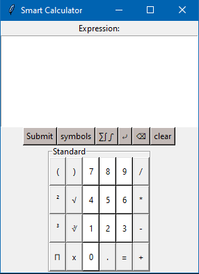
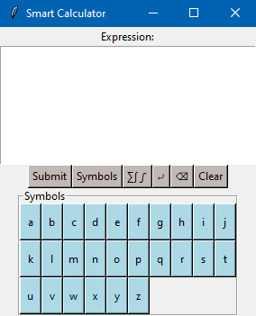
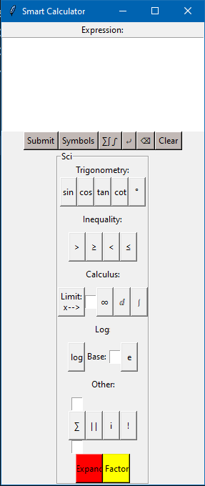

# Smart-Calculator
Advanced Calculator using Python and Sympy library





# Installation
Clone the repo:
```sh
git clone https://github.com/PROuserR/Smart-Calculator
```

Create a new virtual environment:
```sh
python -m venv .venv
```

Activate the virtual environment:
```sh
. .venv/Scripts/activate
```

Install the requirements:
```sh
pip install -r requirements.txt
```

# Running
To launch the website simply run the main.py script:

```sh
python main.py
```